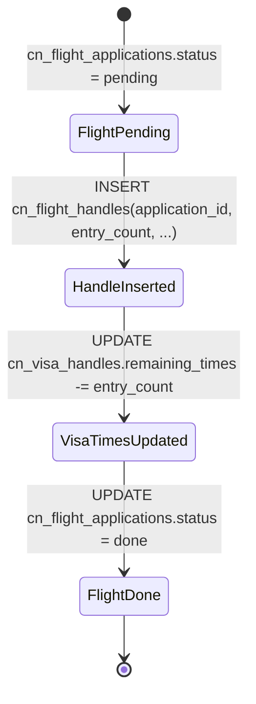
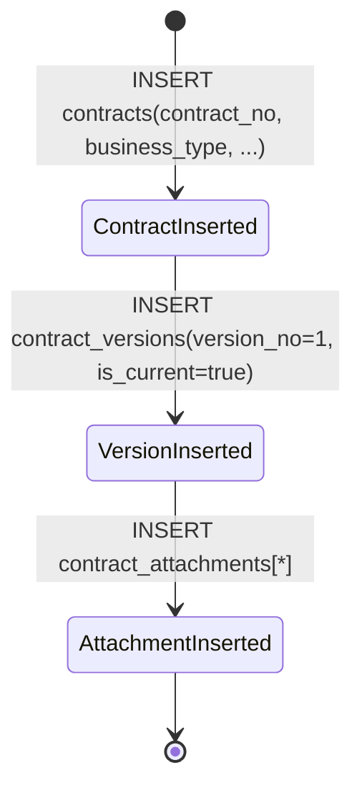
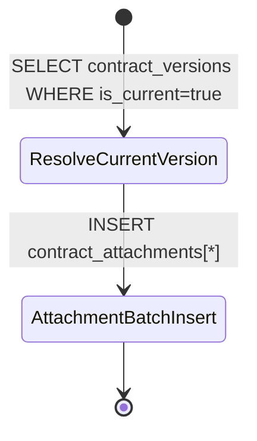

# 多步骤写流程与状态迁移图

> 目标：识别当前前端代码中的“多次写入同一业务流程”的高风险点，明确涉及表/字段及状态迁移，作为 RPC 事务化改造依据。

## 1) `createFlightHandle`（重点）

来源：`src/modules/hr/employees-cn/api.ts#createFlightHandle`。

- 表与字段：
  - `cn_flight_applications.status`: `pending -> done`
  - `cn_visa_handles.remaining_times`: `N -> max(0, N-entry_count)`（`-1` 表示无限次）
  - `cn_flight_handles`: 新增办理记录（与 `application_id` 关联）

## 2) 合同创建 + 附件关联（重点）

来源：`src/modules/contracts/api.ts#createContractWithFiles`。

- 表与字段：
  - `contracts`: 创建合同主记录（唯一键通常在 `contract_no`）
  - `contract_versions`: 创建当前版本（`version_no=1`, `is_current=true`）
  - `contract_attachments`: 批量写入附件元数据并关联 `contract_id` + `contract_version_id`

## 3) 既有合同补传文件 / 附件上传

来源：`src/modules/contracts/api.ts#uploadContractFiles`、`#uploadAttachmentFiles`。

- 表与字段：
  - `contract_versions.is_current=true`：定位当前版本
  - `contract_attachments`: 批量插入（附件日期、附件编号、remark 等）

## 4) 其他已识别的多步骤流程（同类风险）

来源：`src/modules/hr/employees-cn/api.ts`。

- `createInvitationHandle`
  - `INSERT cn_invitation_handles`
  - `UPDATE cn_invitation_applications.status: pending -> done`
- `createVisaHandle`
  - `INSERT cn_visa_handles`
  - `UPDATE cn_visa_applications.status: pending -> done`
- `createLaborPermitHandle`
  - `INSERT cn_labor_permit_handles`
  - `UPDATE cn_labor_permit_applications.status: pending -> done`
- `createTransferRecord`
  - `INSERT cn_transfer_records`
  - `UPDATE cn_employees.department/position`

---

## 风险总结

未事务化时，任一中间步骤失败会造成：
- “办理记录已插入但申请状态未改”
- “签证次数已扣减但机票办理失败”
- “合同/版本已创建但附件元数据不完整”

本次改造在数据库侧新增 RPC（Postgres function）封装事务，并加入请求级幂等键表，确保关键流程具备：
1. 原子性（all-or-nothing）
2. 业务错误码与错误消息统一返回
3. 重试/重复点击安全
